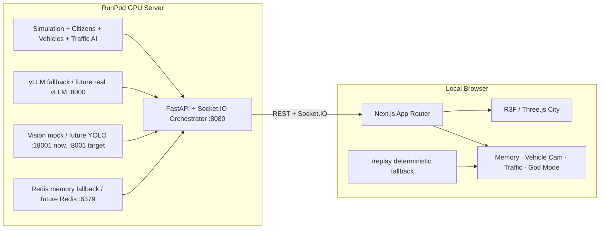

# Architecture Diagram

```mermaid
flowchart LR
  subgraph RunPod["RunPod GPU Server"]
    VLLM["vLLM fallback / future real vLLM :8000"]
    Vision["Vision mock / future YOLO :18001 now, :8001 target"]
    Orchestrator["FastAPI + Socket.IO Orchestrator :8080"]
    Sim["Simulation + Citizens + Vehicles + Traffic AI"]
    Redis["Redis memory fallback / future Redis :6379"]
  end

  subgraph Browser["Local Browser"]
    Next["Next.js App Router"]
    R3F["R3F / Three.js City"]
    Panels["Memory · Vehicle Cam · Traffic · God Mode"]
    Replay["/replay deterministic fallback"]
  end

  Sim --> Orchestrator
  VLLM --> Orchestrator
  Vision --> Orchestrator
  Redis --> Orchestrator
  Orchestrator -- REST + Socket.IO --> Next
  Next --> R3F
  Next --> Panels
  Replay --> Panels
```
